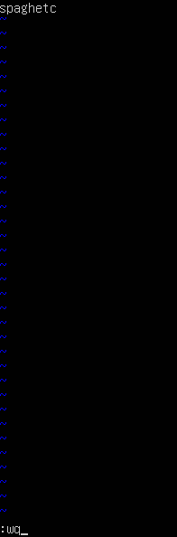
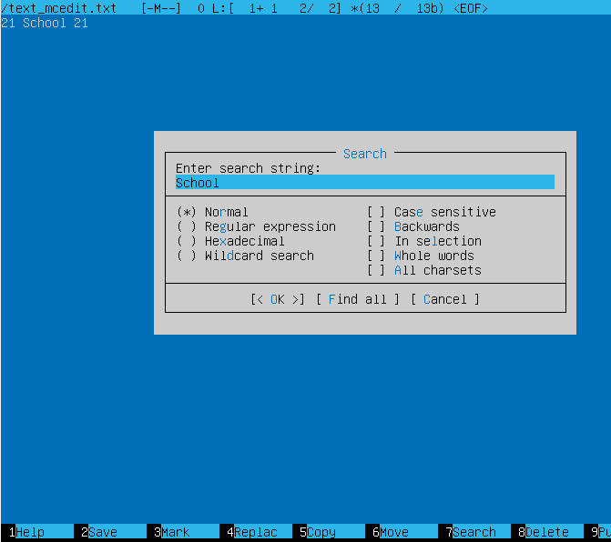
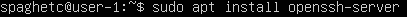
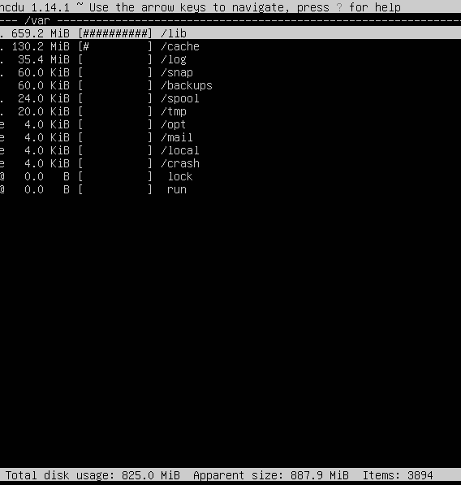

# DO1_Linux

## Part 1. Установка ОС
-  
  Получили версию Ubuntu, выполнив команду `cat /etc/issue`.

## Part 2. Создание пользователя
-  
  Создали нового пользователя командой `sudo adduser spaghetc2`.

-  
  Добавили пользователя в группу `adm` командой `sudo usermod -aG adm spaghetc2`.

-  
  Убедились, что пользователь принадлежит к группе `adm` командой `groups spaghetc2`.

-  
  Новый пользователь есть в выводе команды `cat /etc/passwd`.

## Part 3. Настройка сети ОС

-  
  Задали название машины вида `user-1` командой `sudo hostnamectl set-hostname user-1`.

-  
  Вывели название машины командой `hostname`.

-  
  Установили временную зону в соответствии с местоположением командой `timedatectl set-timezone Europe/Moscow`.

-  
  Проверили, что временная зона установилась командой `timedatectl`.

-  
  Получили информацию о сетевых интерфейсах командой `ip a`.

- Интерфейс `lo` является виртуальным сетевым интерфейсом, используемым для связи приложений и процессов. Имеет фиксированный IP-адрес `127.0.0.1` и маску подсети `255.0.0.0`.

-  
  Получили информацию об IP-адресе устройства от DHCP-сервера командой `sudo dhclient -v`.

- DHCP (Dynamic Host Configuration Protocol) — это сетевой протокол, который автоматизирует процесс назначения IP-адресов и других сетевых параметров устройствам в сети.

-  
  Получили внешний IP-адрес шлюза (ip) командой `curl 2ip.ru`. 

-  
  Получили внутренний IP-адрес шлюза (gw) командой `ip route`.

-  
  Открываем файл конфигурации `Netplan` командой `sudo nano /etc/netplan/00-installer-config.yaml`.

-  
  Задали статичные настройки ip, gw, dns.
  1. Установили `dhcp4` в `false`, чтобы отключить динамическое назначение IP-адресов.
  2. Указали статический IP-адрес сервера `10.0.2.119/24`.
  3. Указали внутренний IP-адрес шлюза `10.0.2.2`.
  4. Указали `dns` Google `8.8.8.8`.
  5. Указали публичный DNS-резолвер `1.1.1.1`.

-  
  Применяем настройки командой `sudo netplan apply`.

-  
  Перезапускаем виртуальную машину командой `reboot`.

-  
  Получаем внутренний IP-адрес шлюза (gw) командой `ip route`.

-  
  Проводим успешный пинг хостов `1.1.1.1` и `ya.ru(77.88.44.242)` командой `ping`.

## Part 4. Обновление ОС

-  
  Проверим актуальность текущих системных пакетов командой `sudo apt update`.

-  
  Проводим обновление системных пакетов командой `sudo apt full-upgrate`.

## Part 5. Использование команды sudo

- `sudo` (расшифровывается как `superuser do`) - используется для выполнения пользователем какой-либо команды, требующей права суперпользователя(root).

-  
  Дали право пользователю `spaghetc2` использовать команду `sudo`, прописав команду `sudo usermod -aG sudo spaghetc2`.

-  
  Сменили пользователя на `spaghetc2` командой `su spaghetc2`.

-  
  Сменили название машины на `user-2` от имени `spaghetc2` командой `sudo hostname user-2` и убедились, что название изменилось командой `hostname`.

## Part 6. Установка и настройка службы времени

-  
  Включаем синхронизацию NTP командой `sudo timedatectl set-ntp on`.

-  
  Убедились, что время синхронизируется автоматически командой `timedatectl show`.

## Part 7. Установка и использование текстовых редакторов

### VIM
-  
  Создаем файл `text_vim.txt` и открываем его через vim командой `sudo vim text_vim.txt`.

-  
  Для редактирования файла используем `i`, добавляем строку в файл, нажимаем `ESC` и сохраняем изменения прописывая `:wq`.

-  
  Открывает файл командой `sudo vim text_vim.txt`, заменяем строку на 21 School 21 и выходим без сохранения, прописывая `:q!`.

-  
  Убеждаемся в том, что файл не изменился командой `cat text_vim.txt`.

-  
  Выполняем поиск по слову через `/слово`, прописывая `/School`.

-  
  Выполняем замену по слова на другое через `:s/слово/новое слово`, прописывая `:s/School/21`.

-  
  Получаем результирующий файл.

### NANO
-  
  Создаем файл `text_nano.txt` и открываем его через nano командой `sudo nano text_vim.txt`.

-  
  Пишем строку, нажимаем `ctrl + o`, затем `ctrl + x`, выходя без сохранения.

-  
  Открывает файл командой `sudo nano text_vim.txt`, заменяем строку на 21 School 21 и выходим без сохранения, нажимая `ctrl + x` и не соглашаясь сохранить изменения.

-  
  Убеждаемся в том, что файл не изменился командой `cat text_nano.txt`.

-  
  Выполняем поиск по слову через `ctrl + w`, прописывая `School`.

-  
  Выполняем замену слова на другое через `ctrl + \`, заменяя `School` на `21`.

-  
  Получаем результирующий файл.

### MCEDIT
-  
  Устанавливаем редактор `mcedit` с пакетом `mc`.

-  
  Создаем файл `text_mcedit.txt` и открываем его через `mcedit` командой `sudo mcedit text_mcedit.txt`.

-  
  Отредактировав документ, нажимаем F10 и отвечаем Yes для выхода с сохранением.

-  
  Открывает файл командой `sudo mcedit text_mcedit.txt`, заменяем строку на 21 School 21 нажимаем F10 и выходим без сохранения, отвечая NO.

-  
  Убеждаемся в том, что файл не изменился командой `cat text_mcedit.txt`.

-  
  Выполняем поиск по слову `School` через F7.

-  
  Выполняем замену по слова на другое через F4.

-  
  Получаем результирующий файл.

## Part 8. Установка и базовая настройка сервиса SSHD

-  
  Устанавливаем `openssh-server` командой `sudo apt install openssh-server`.

-  
  Добавляем автостарт службы при загрузке системы командой `systemctl enable ssh`

-  
  Запускаем службу командой `systemctl start ssh` и проверяем статус командой `systemctl status ssh`.

-  
  Открываем файл командой `sudo nano /etc/ssh/sshd_config` и перенастраиваем службу SSHd на порт 2022.

-  
  Запускаем службу командой `systemctl start ssh` и проверяем статус командой `systemctl status ssh`.
  

-  
  Используя команду `ps`(команда для отображения отчета о работающих процессах) с флагами `-e` - расширяет вывод и `-f` - показывает полный формат списка процессов (UID пользователя, PID процесса, PPID родительского процесса, время запуска и команду, которая была использована для запуска процесса).

- Выполним перезагрузку системы командой `sudo reboot`.

-  

- Флаги `-tan` используются соответственно для того, чтобы показать порты tcp, список всех портов, показывать в численном виде ip адреса.

- Значения столбцов
  - Proto - наименование протокола.
  - Recv-Q - количество запросов в очередях на прием на локальном компьютере.
  - Send-Q - количество запросов в очередях на отправку на локальном компьютере.
  - Local Address - IP-адрес и порт локального компьютера.
  - Foreign Address - IP-адрес и порт компьютера, к которому подключен локальный компьютер.
  - State - статус соединения по протоколу TCP.
  - 0.0.0.0 - зарезервированный IP-адрес, обозначающий все возможные IP-адреса, означает, что сервер прослушивает все доступные сетевые интерфейсы на данном порту.

## Part 9. Установка и использование утилит top, htop

### Утилита top
- Запустим, используя команду `top`.

-  

- uptime: 2:50 h.
- количество авторизованных пользователей: 1.
- средняя загрузка системы: 0.05, 0.01, 0.00.
- общее количество процессов: 100.
- загрузка Cpu: 0.0 us, 7.1 sy, 0.0 ni, 92.9 id, 0.0 wa, 0.0 hi, 0.0 si, 0.0 st.
- загрузка памяти MiB Mem: 2974.6 total, 2373.0 free, 156.0 used, 445.5 buff/cache.
- pid процесса занимающего больше всего памяти: %MEM PID 1.
- pid процесса, занимающего больше всего процессорного времени: PID 2917.

### Утилита htop

- Запустим, используя команду `htop`.
- Используем для сортировки F6.

-  
Сортировка по PID.

-  
Сортировка по PERCENT_CPU.

-  
Сортировка по PERCENT_MEM.

-  
Сортировка по TIME.

-  
Отфильтруем для процесса sshd, нажав F4 и написав Filter: sshd.

-  
Поиск syslog через F3, прописав Search: syslog.

-  
Добавление вывода hostname, clock и uptime F2 + необходимые параметры + ESC.

## Part 10. Использование утилиты fdisks

- Используем команду `sudo fdisk -l`.

-  

- название жесткого диска: /dev/sda
- размер диска: 30 GiB, 32212254720 bytes
- количество секторов: 62914560 sectors
- размер swap 2,9 GiB, выводится командой `free -h`

## Part 11. Использование утилиты df

- Пропишем команду `df`.

-  

- размер раздела: 14,339,080
- размер занятого пространства: 6,438,360
- размер свободного пространства: 7,150,540
- процент использования: 48%.
- единица измерения в выводе — блоки по 1 Килобайт (KiB).
- Пропишем команду `df -Th`.

-  

- размер раздела: 14 ГиБ (Gigabytes)
- размер занятого пространства: 6.2 ГиБ (Gigabytes)
- размер свободного пространства: 6.9 ГиБ (Gigabytes)
- процент использования: 48%
- тип файловой системы для корневого раздела — ext4.

## Part 12. Использование утилиты du

-  
Пропишем команду  `du`.

-  
- Получим размер папок /home, /var, /var/log (в человекочитаемом виде)
  - -sh в команде du используется для изменения формата вывода, делая его более удобочитаемым для человека.
  - -s: означает "summarize" (сводный). Когда он используется, du выводит только общий размер указанной директории, а не размеры всех её поддиректорий.
  - -h: означает "human-readable" (человекочитаемый). Он преобразует размеры файлов и директорий в более понятные единицы измерения, такие как килобайты (K), мегабайты (M), гигабайты (G) и т.д., вместо вывода размеров в байтах. Это делает вывод более читабельным и позволяет легче оценить, сколько места занимает каждая директория.

-  
- Получим размер папок /home, /var, /var/log (в байтах)
  - -b указывает du выводить размеры файлов и директорий в байтах.
  - --max-depth=0 ограничивает глубину рекурсии du. Значение 0 означает, что будут показаны только корневые директории

-  
Получим размер всего содержимого в /var/log (не общее, а каждого вложенного элемента, используя *)

## Part 13. Установка и использование утилиты ncdu

-  
Установим утилиту ncdu командой `sudo apt install ncdu`.

- Выход осуществляется через `q`.

-  
Получим размер папки `ncdu /home`.

-  
Получим размер папки `ncdu /var`.

-  
Получим размер папки `ncdu /var/log`.

## Part 14. Работа с системными журналами

- `cat /var/log/dmesg` используется для диагностики проблем с оборудованием и ядром операционной системы

- `cat  /var/log/syslog` собирает сообщения от различных компонентов системы, включая службы, демоны и приложения. Он является одним из основных мест для просмотра информации о работе системы. Содержит записи о системных событиях, таких как запуск и остановка служб, ошибки и предупреждения, а также сообщения от многих приложений.

- `cat /var/log/auth.log` содержит записи, связанные с процессами аутентификации пользователей и аудита безопасности. Это включает в себя попытки входа в систему, успешные и неудачные авторизации, изменения паролей и другие действия, связанные с безопасностью системы. Этот журнал полезен для аудита безопасности и отслеживания действий пользователей.

-  
Пропишем команду `grep login /var/log/auth.log` время последней успешной авторизации AUG 5 14:28:24 , user spaghetc, by LOGIN

- Выполним перезапуск службы SSHd `sudo systemctl restart ssh`

-  
- Найдем сообщение о рестарте службы командой `cat /var/log/syslog`

## Part 15. Использование планировщика заданий CRON

-  
Пропишем команду `sudo crontab -e`.

-  
Выберем из предложенных редакторов nano. В конце файла пропишем строку `*/2 * * * * uptime`.

- Далее по порядку
 - (*/2) - Определяет минуты. */2 означает "каждые 2 минуты".
 - (*) - Определяет часы. Звездочка означает "любой час".
 - (*) - Определяет день месяца. Звездочка означает "любой день месяца".
 - (*) - Определяет месяц. Звездочка означает "любой месяц".
 - (*) - Определяет день недели. Звездочка означает "любой день недели".
 - (*/2 * * * * uptime) означает, что команда uptime будет выполняться каждые 2 минуты каждый час каждого дня месяца, каждого месяца, каждого дня недели

-  
3 строки в системных журналах о выполнении

-  
Командой `sudo crontab -l` получим список текущих заданий для cron.

-  
Командой `sudo crontab -r` удалим задания из планировщика. Еще раз получим спискок текущих задач cron и убедимся, что задания удалены.